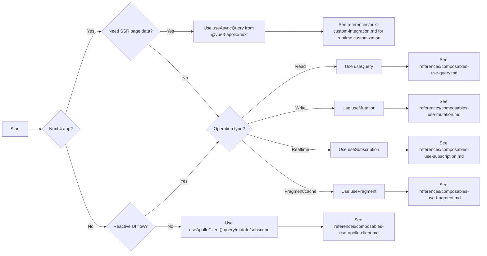

# Overview and Decision Tree

## When to use

Use this file when the request is unclear and you need to choose the right path before coding:

1. Choose between Vue core composables and Nuxt integration.
2. Choose between reactive composables and imperative client calls.
3. Route migration, tracking, TypeScript, and troubleshooting requests.

## Quick context checklist

Collect these inputs first:

1. App type: Vue 3 app or Nuxt 4 app.
2. Data mode: SSR blocking data or client-only data.
3. Operation type: read, write, realtime, fragment/cache, or imperative call.
4. Client setup: single client or multi-client.
5. Main issue: API usage, typing, loading state, or runtime error.
6. Nuxt only: check whether `apollo.autoImports` is enabled.

## Decision tree



## Route by symptom

| Symptom                                                  | Route                   | First action                                                                                            |
|----------------------------------------------------------|-------------------------|---------------------------------------------------------------------------------------------------------|
| "I need server-rendered data on first page load in Nuxt" | `useAsyncQuery`         | Use `await useAsyncQuery({ query, variables })` in `script setup`                                       |
| "Can useQuery prefetch replace useAsyncData?"            | Nuxt SSR decision       | Treat `useQuery({ prefetch: true })` as SSR-capable, but prefer `useAsyncQuery` for Nuxt page data flow |
| "Nuxt says composable is not defined"                    | Nuxt setup check        | Confirm module is installed and `apollo.autoImports` is enabled, or add explicit imports                |
| "My data should react to ref/computed changes"           | `useQuery`              | Start with `useQuery(document, () => variables)`                                                        |
| "I need submit/save action with callbacks"               | `useMutation`           | Use `useMutation` + `mutate` + `onDone`/`onError`                                                       |
| "I need live updates"                                    | `useSubscription`       | Ensure `graphql-ws` is installed and `wsEndpoint` is configured                                         |
| "I only need direct client calls"                        | `useApolloClient`       | Use `const client = useApolloClient()` then `client.query/mutate`                                       |
| "Loading state should be shared globally or by section"  | tracking helpers        | Use `useApolloTrackingStore` or `useQueriesLoading(id?)`                                                |
| "Code from @vue/apollo-composable is breaking"           | migration path          | Apply migration rules before feature work                                                               |
| "Type inference is weak or errors are noisy"             | TypeScript/codegen path | Route to TypedDocumentNode or codegen setup                                                             |

## Case examples

### Case 1: Happy path (Nuxt SSR query)

When the user asks for first-render SEO-safe data in Nuxt, use `useAsyncQuery`.

```vue
<script setup lang="ts">
import { gql } from 'graphql-tag'

const GET_POSTS = gql`
  query GetPosts {
    posts { id title }
  }
`

const { data, pending, error } = await useAsyncQuery({
  query: GET_POSTS,
})
</script>
```

Nuxt SSR note:

1. `useQuery({ prefetch: true })` can run SSR prefetch via Vue `onServerPrefetch`.
2. It does not replace Nuxt `useAsyncData`/`AsyncData` contract.
3. For page-level Nuxt SSR data flow, prefer `useAsyncQuery`.
4. If `apollo.autoImports` is disabled, import `useAsyncQuery` manually from `@vue3-apollo/nuxt`.

### Case 2: Edge case (conditional reactive query)

When query execution must wait for user input and avoid noisy requests, use `enabled` and `debounce`.

```ts
import { computed, ref } from 'vue'
import { useQuery } from '@vue3-apollo/core'

const search = ref('')
const enabled = computed(() => search.value.trim().length >= 2)

const { result, loading } = useQuery(
  SEARCH_USERS,
  () => ({ q: search.value }),
  {
    debounce: 300,
    enabled,
    keepPreviousResult: true,
  }
)
```

### Case 3: Failure case (client not found / missing setup)

When a request fails because a client is missing, validate client registration before debugging query logic.

```ts
import { useApolloClient, useApolloClients } from '@vue3-apollo/core'

const clients = useApolloClients()
console.log('Registered clients:', Object.keys(clients))

// Ensure the id exists before using it.
const analyticsClient = useApolloClient('analytics')
```

If this throws, fix app setup first:

1. Vue app: ensure `apolloPlugin` is installed and `clients` contains expected ids.
2. Nuxt app: ensure `apollo.clients` in `nuxt.config.ts` includes the expected client id.

## Pitfalls

1. Using `useQuery` for Nuxt page-blocking SSR data when `useAsyncQuery` is the correct fit.
2. Forgetting `graphql-ws` while using `useSubscription` with `wsEndpoint`.
3. Using old positional `useAsyncQuery` arguments instead of object options.
4. Assuming a named client exists without validating `clientId`.
5. Returning user-facing snippets with internal path imports instead of `@vue3-apollo/core` or `@vue3-apollo/nuxt`.
6. Treating `useQuery({ prefetch: true })` as equivalent to Nuxt `useAsyncData`.
7. Assuming Nuxt composables are always auto-imported even when `apollo.autoImports` is disabled.

## Cross-reference

Use these files after routing:

1. `references/setup-core-vue3.md`
2. `references/setup-nuxt4.md`
3. `references/composables-use-query.md`
4. `references/composables-use-mutation.md`
5. `references/composables-use-subscription.md`
6. `references/composables-use-fragment.md`
7. `references/composables-use-apollo-client.md`
8. `references/tracking-and-loading.md`
9. `references/typescript-and-codegen.md`
10. `references/migration-from-vue-apollo-composable.md`
11. `references/nuxt-custom-integration.md`
12. `references/troubleshooting.md`
13. `references/testing-checklist.md`
